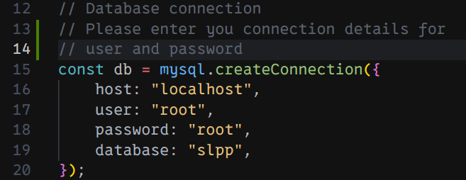

# Shangrila Petition Web App

- There are two folders named frontend and backend.

## Backend setup

- `cd` to `backend`.
- Run `npm install` which installs all the necessary packages and dependencies from `package.json`.
- Run the `mgm22.sql` file on mysql workbench to create database and tables.
- Change the db credentials in `server.js` as follows:
  
- Run the application using `npm run dev` command.

## Frontend setup

- `cd` to `frontend`.
- Run `npm install` which installs all the necessary packages and dependencies from `package.json`.
- Run the application using `npm run dev` command.
